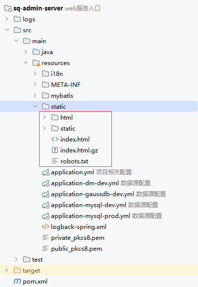
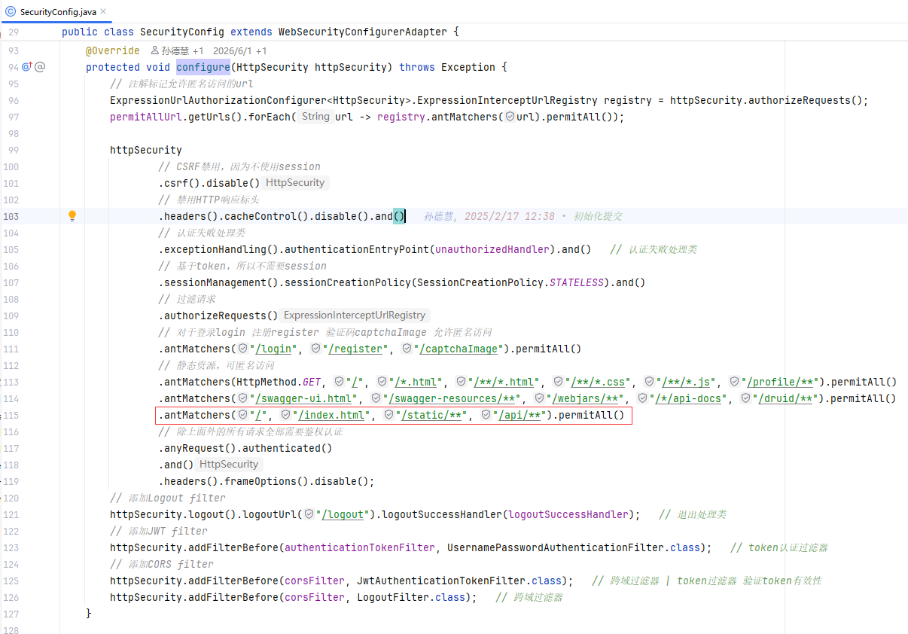
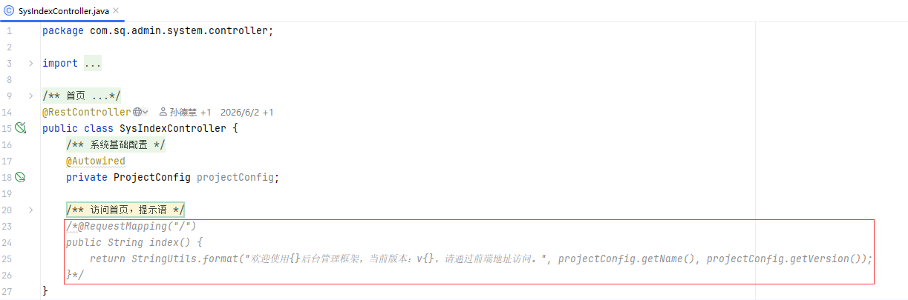

1. 将前端项目打包，获取dist文件;

2. 将dist目录下的文件（不包含dist文件）放至项目的`/resource/static`目录下;
    

3. 开放静态文件访问权限，在`SecurityConfig`中添加`.antMatchers("/", "/index.html", "/static/**", "/api/**").permitAll()`;
    

4. 去除`SysIndexController`中访问项目根路径的首页提示语，这样访问项目根路径就可以跳转`index.html`；
    
5. 打包后端项目并部署至服务器，访问项目根路径（http://IP:PORT/）。
